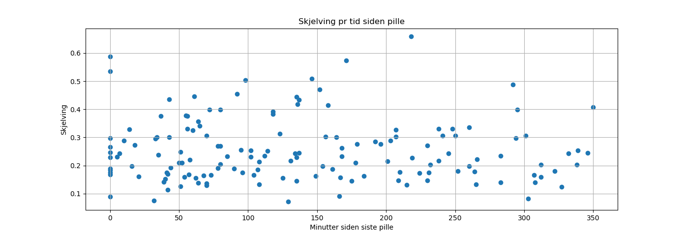
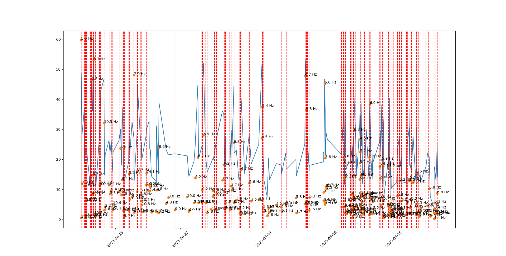
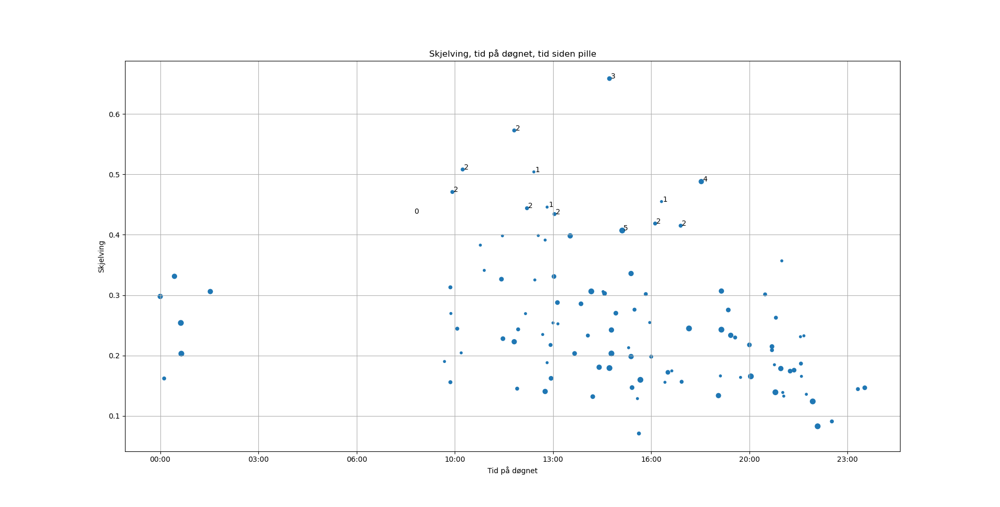

Analyse av data fra ParkinsonTracker

Må ha: 
* data tatt opp med ParkinsonTracker
* python 3 med numpy, matplotlib

1. Last ned dataene som json
2. Legg json-fil i src/main/resources
3. Kjør MainSpectrumAnalysis
4. Åpne python-fila i din yndlingseditor
5. Kopier dataene som ble skrevet ut av Java-programmet over i plotshakes.py
6. Kjør plotshakes.py med python3

